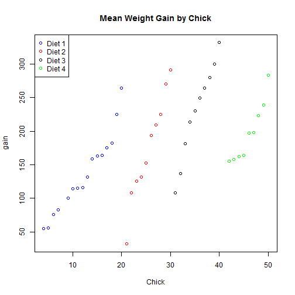

## The Goal
### Create a working, interactive demonstration of a shiny application and a slide presentation describing the work using slidify.

--- .class #id 

## The Project
### In this project the dataset, ChickWeights, which is found in the datasets library in r, was reshaped to allow calculation of the mean gain in weight of 21 day old chicks by each of four diets.  Shiny was used to set up a user interface that allows the user to select the diet and view the mean weight gain in grams of the 18 chick sample for the selected diet.  

--- 
### When weight gain for individual chicks is plotted, we can see a pattern. 

```
## 
## Attaching package: 'dplyr'
## 
## The following object is masked from 'package:stats':
## 
##     filter
## 
## The following objects are masked from 'package:base':
## 
##     intersect, setdiff, setequal, union
```

 

--- 

### Mean weight gain by Diet indicates there is a relationship between diet and weight gain. 

```
##   Diet     gain
## 1    1 136.1875
## 2    2 174.0000
## 3    3 229.5000
## 4    4 197.6667
```
### See the interactive shiny app 
https://helcia.shinyapps.io/shinyapp/
---
